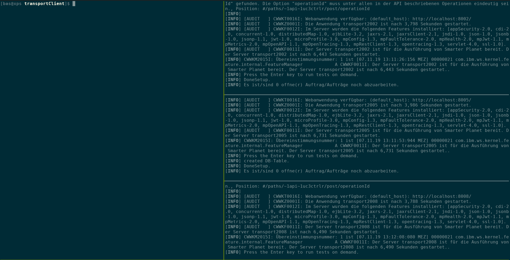

# Transporter-Demos
 Demos different ways to transport files through webservices.

[](http://unmaintained.tech/)

## Use Cases

### Use Case 1
 File is embedded in JSON Data. JSON Data ist always serialized and deserialized between the services.

### Use Case 2

#### Use Case 2a
 File is embedded in JSON Data, from client to transport2002. 2002-Service writes to database an transmits the id instead of file data. Transport2005 only passes the id. Transport2008 access DB with id to extract file data. 
 * Requierements: 
    * transport2002 must be able to write to DB
    * transport2008 must be able to read from DB

* trade-offs:
    * transport2005 can't verify if message is "complete"
    * transport2008 can't verify if correct file is referenced


#### Use Case 2b (optional|TODO)
Same as above, only that transport2002 and transport2005 share DB_Table_1 and transport2005 and transport 2008 share DB_Table_2. 
Transport2002 writes to DB_Table_1 and passes id, therefore transport2005 could verify data. Afterwards transport2005 writes to shared DB_Table_2 and now transport2008 can read and verify.


### Use Case 3
 File is embedded in JSON Data, from client to transport2002. 2002-Service writes to database an transmits the id instead of file data. Transport2005 receives id, & message-data and dumps both to "buffer". Async it accesses the file-Endpoint from transport2002 to receive file-data. Thereafter filedata is stored to db and messagedata is transfered to transport2008 with new id.  Transport2008 muss dump messagedata and id to "buffer". Async it access fileservice from transport2005, dumps filedata to db. And on it goes ...
 * Requierements: 
    * transport2002 must be able to write to db and read from DB. Must have its own db, because it could be done accross networks / datacenters.
    * transport2005 must be able to write to db and read from DB. Must have its own db, because it could be done accross networks / datacenters.
     *transport2008 must be able to write to db and read from DB. Must have its own db, because it could be done accross networks / datacenters.
* trade-offs:
    * more dbs, more "async" foo.
    * needs a lot more monitoring and checking

## Usage

### Requierement

To start using the demo the project [transportShared](/transportShared/README.md) has to be built using
``` maven
mvn clean package install
```
because the other projects need the [Message.class](/transportShared/src/main/java/de/basgrau/transporter/shared/model/Message.java).

### Quick Tipp
I recommend to use [TMUX](https://github.com/tmux/tmux/wiki), it will make it easier to watch the progress of the "Message" through all the endpoints / nodes.

<u>Short basic cheat sheet:</u>
* press ```ctrl-b``` and then press ```"``` for horizontal split or ```%``` for vertical split.
* press ```ctrl-b``` and then press the arrow keys to move between split windows.
* hold ```ctrl-b``` and use the arrow keys to shrink or grow current active split window.

### Start using

* Start tmux session
* as the first step switch in all backend-services project directories and start all backend-services with the command ``` mvn liberty:dev ``` in the following order:
    * [transport2002](/transport2002/readme.md)
    * [transport2005](/transport2005/readme.md)
    * [transport2008](/transport2008/readme.md)
    
* each backend-service will serve a basic templated html page at ```http://localhost:8{last 3 numbers of backend-service}/``` e.g. http://localhost:8002/

* now choose which "test" should be run:
    * without argument "Use Case 3" will be chosen, with an file around 15MB
    * you can use one argument:
        * 'uc1' or 'uc2' or 'uc3' or 'alle'
        * all will be running with an file around 15MB
    * you can use two arguments:
        * 1. Argument: 'uc1' or 'uc2' or 'uc3' or 'alle'
        * 2. Argument: 'TEXT' (will send "Hallo Welt" instead off 15MB file)
    * you need to switch to the [transportClient](/transportClient/README.md) directory to run command ``` java -jar /target/transportClient.jar ```

### Databases
The H2Databases will live in your home directory in 'transporter-demo'.

## Screenshots

Starting


Use Case 1 - Result 15MB file


Use Case 1 - Result


Use Case 3 - Start 15MB file


Use Case 3 - End


Use Case 3 - Start Hallo Welt


Use Case 3 - End


